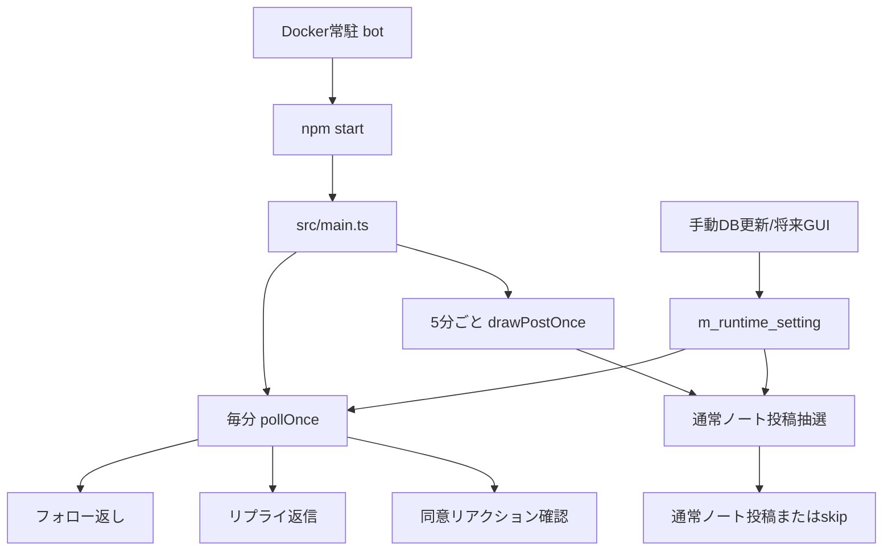
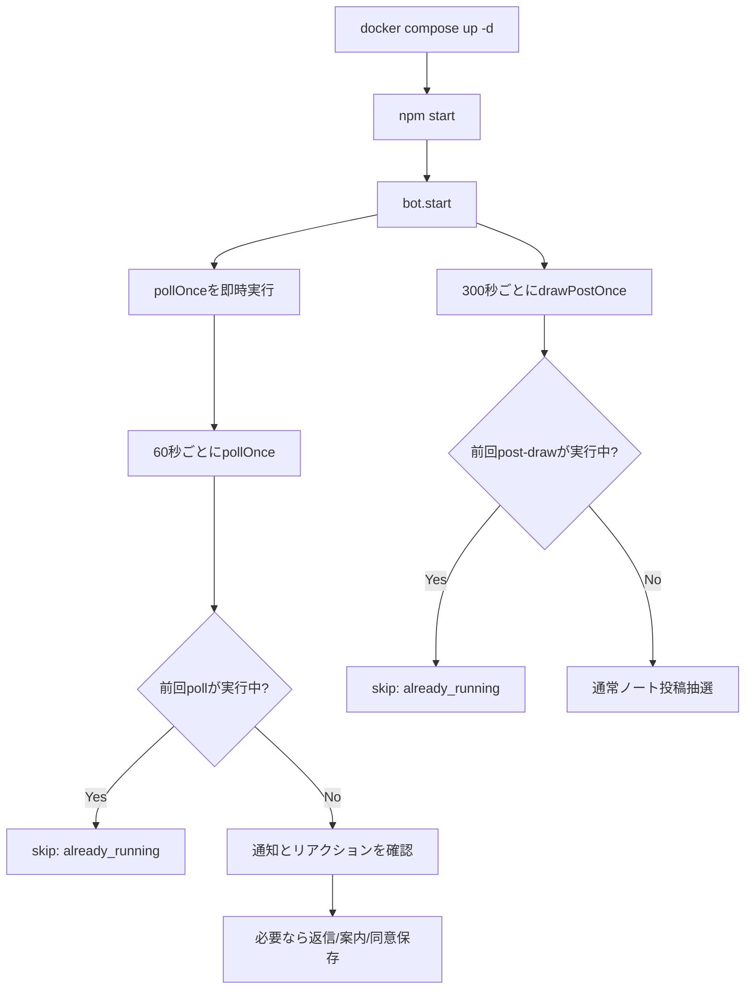
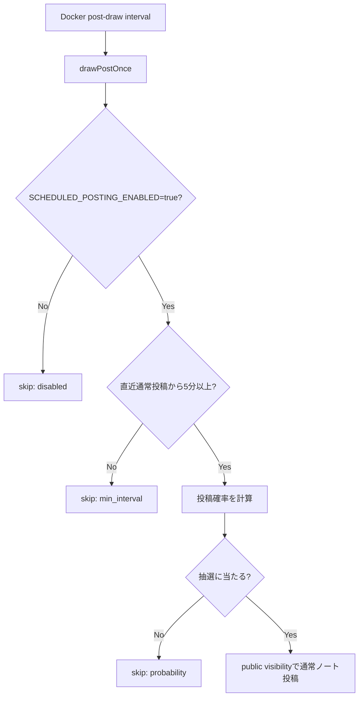

# スクリプト概要

このPJで動かす実行入口を、常駐、定期実行、管理用に分けて整理する。

## 全体像

## 現行スクリプト一覧

| 実行入口 | 実体 | 起動元 | 主な役割 | 投稿する可能性 |
|---|---|---|---|---|
| `npm start` | `node dist/main.js` | Docker常駐 | 毎分polling、フォロー返し、リプライ返信、❤同意確認、5分ごとの投稿抽選 | 返信、フォロー案内、通常ノート |
| `npm run dev` | `tsx watch src/main.ts` | ローカル開発 | 常駐アプリの開発用watch | あり。実token使用時は注意 |
| `npm run scheduled:post-draw` | `tsx src/scheduled.ts post-draw` | ローカル手動 | 投稿抽選を1回だけ実行 | 通常ノート |
| `npm run scheduled:post-draw:prod` | `node dist/scheduled.js post-draw` | Docker手動 | build済みJSで投稿抽選を1回だけ実行 | 通常ノート |
| `npm run db:migrate` | `tsx src/db/migrate.ts` | 手動 / 初期化 | DB schema作成とseed | なし |
| `npm test` | `vitest run` | 手動 / CI候補 | テスト実行 | なし |
| `npm run build` | `tsc -p tsconfig.json` | 手動 / CI候補 | TypeScript build | なし |

## Docker常駐アプリ

Docker常駐アプリは、Misskey通知への反応と通常ノートの定期投稿抽選を担当するプロセス。

### Docker常駐が担当すること

- `i/notifications` から `follow` を取得する。
- 未案内のフォロワーにフォロー返しを行う。
- フォロー案内ノートを投稿する。
- `mention` / `reply` に定型返信する。
- `/stop` と `/unfollow` を処理する。
- ピン留め同意ノートの❤リアクションを読み、許可済みユーザーをDBへ登録する。
- 処理上限は `m_runtime_setting` の `FOLLOW_PROBE_MAX_PER_POLL`、`REPLY_PROBE_MAX_PER_POLL`、`NOTIFICATION_FETCH_LIMIT`、`REACTION_FETCH_LIMIT` で調整する。

### Docker常駐が担当しないこと

- TL観測や体験候補収集。
- 設定変更GUI。

これらは今後追加する別スクリプトまたは管理画面で扱う。

## Docker常駐投稿抽選

Docker常駐プロセスは、`POST_DRAW_INTERVAL_SECONDS` ごとに投稿抽選を実行する。
タイマーが起動することと、投稿されることは別。

## 設定変更の考え方

今後、設定変更用CLIまたはGUIを追加する場合は、直接コードを書き換えず `m_runtime_setting` を更新する。

初期候補:

- `runtime-setting:list`: `m_runtime_setting` を一覧表示する。
- `runtime-setting:set <key> <value>`: 運用値を1つ更新する。
- 管理GUI: DB上の運用値を画面から編集する。

secretはこの仕組みに載せない。
`MISSKEY_TOKEN`、`DATABASE_URL`、`CHUTES_API_KEY`、`OPENAI_API_KEY` は引き続き `.env.local` で管理する。

## 参照先

- [Dockerローカル常駐ガイド](docker-local-run.md)
- [投稿実行ルール](../spec/posting-runtime-rules.md)
- [投稿内容ルール](../spec/posting-content-rules.md)
- [DB schema](../spec/db-schema.md)
