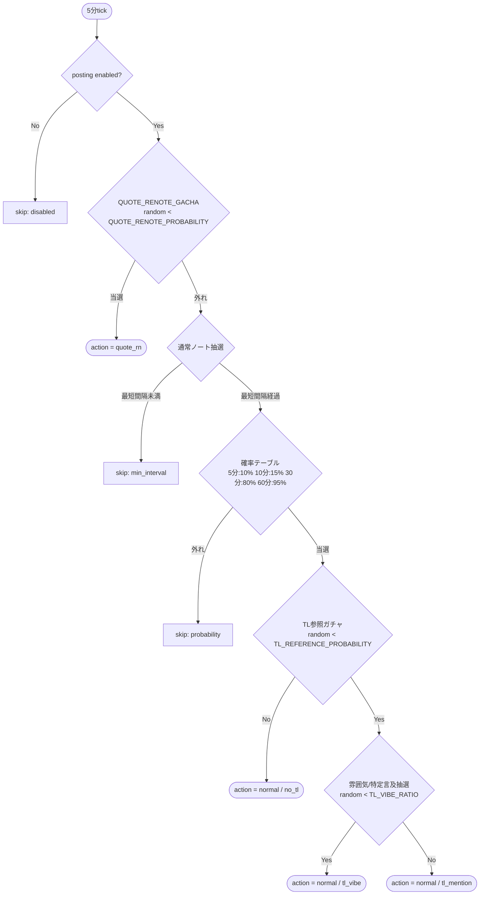
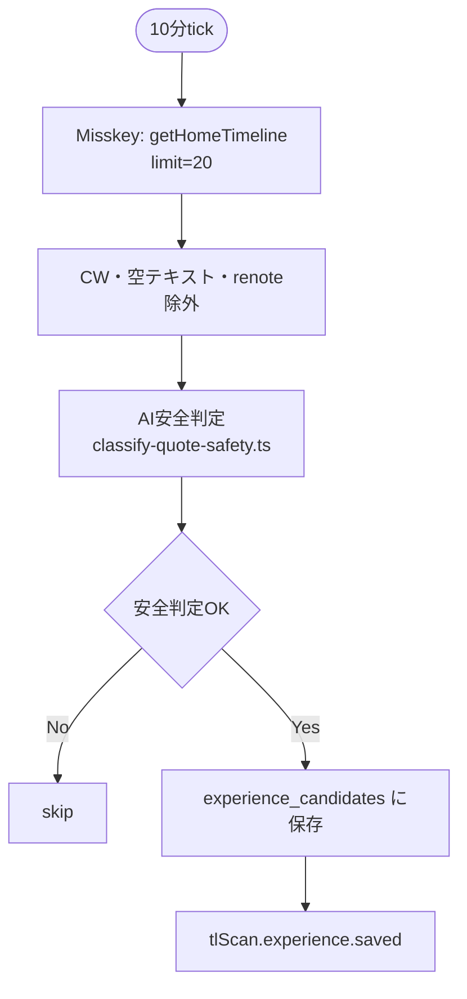

# 行動フロー V2（2026-05-03）

## 概要

Phase 3完了後の設計変更を反映した、新しい行動ガチャ・投稿フロー。

主な変更:
- **独立ガチャ**: 従来の「TL観測に入ってから引用RNガチャ」という階層構造を廃止し、quote_rn / tl_observation / normal を独立した確率で直接抽選
- **tl_observation廃止**: 通常ノートの一部として統合（`posts.kind = 'tl_observation'` は既存データのために残すが新規投稿は `normal`）
- **通常ノートのTL参照**: 通常ノートの一部で TL 20件を取得し、その雰囲気に言及するパターンを追加
- **体験メモリ**: 通常ノート生成時に `experience_logs` の履歴をプロンプトに弱く注入
- **体験候補蓄積**: 10分ごとに TL を取得し、`experience_candidates` に安全なノートを蓄積（Phase 4実装）

## 確率表

### Normal Mode（BETA_TEST1_ENABLED = false）

| 行動 | 確率 | 条件・補足 |
|---|---|---|
| **引用RN投稿** | **20%** | `QUOTE_RENOTE_PROBABILITY = 0.20`。許可済みユーザーのノートを引用 |
| **通常ノート（TL参照なし）** | **40%** | 通常ノートの50%。最短間隔+確率テーブル |
| **通常ノート（TL参照→雰囲気言及）** | **30%** | 通常ノートの50% × TL参照75%。TL 20件取得し傾向に言及 |
| **通常ノート（TL参照→特定言及）** | **10%** | 通常ノートの50% × TL参照25%。特定事象に言及 |

**計算式:**
- 引用RN: `QUOTE_RENOTE_PROBABILITY` (0.20)
- 通常ノート全体: 残りの 0.80
  - TL参照なし: 0.80 × 0.50 = 0.40
  - TL参照(雰囲気言及): 0.80 × 0.50 × 0.75 = 0.30
  - TL参照(特定言及): 0.80 × 0.50 × 0.25 = 0.10

### Beta-Test1 Mode（BETA_TEST1_ENABLED = true）

| 行動 | 確率 | 条件・補足 |
|---|---|---|
| **引用RN投稿** | **40%** | `QUOTE_RENOTE_PROBABILITY = 0.40`（beta-test1値） |
| **通常ノート（TL参照なし）** | **20%** | 通常ノートの33%。最短間隔+確率テーブル |
| **通常ノート（TL参照→雰囲気言及）** | **30%** | 通常ノートの67% × 75% |
| **通常ノート（TL参照→特定言及）** | **10%** | 通常ノートの67% × 25% |

**計算式:**
- 引用RN: `QUOTE_RENOTE_PROBABILITY` (0.40)
- 通常ノート全体: 残りの 0.60
  - TL参照なし: 0.60 × 0.33 ≈ 0.20
  - TL参照(雰囲気言及): 0.60 × 0.67 × 0.75 ≈ 0.30
  - TL参照(特定言及): 0.60 × 0.67 × 0.25 ≈ 0.10

## 行動ガチャフロー（5分post-draw）



## 各アクションの処理

### action = quote_rn（引用RN投稿）

**Phase 2（取得）:**
1. `runTlScanPassive()` で TL 取得 → `source_notes` に保存
2. `pickQuoteCandidate()` で許可済みユーザーの安全なノートを探索
3. 安全判定（`classify-quote-safety.ts`）→ OKなら候補確定

**Phase 3（生成・投稿）:**
1. `generateQuotePostText()` で引用コメント生成
2. `createNote({ text, renoteId })` で引用RN投稿
3. `posts` に `kind = 'quote_renote'` で保存
4. `experience_logs` に引用体験を記録

**フォールバック:**
- 候補なし → skip（通常ノートには**落ちない**）
- AI失敗 → skip（通常ノートには**落ちない**）

### action = normal / no_tl（通常ノート・TL参照なし）

**Phase 2（取得）:**
- 特に外部API呼び出しなし
- DBから過去投稿・source_notes を取得

**Phase 3（生成・投稿）:**
1. `generatePostText({ hint, tlSummaries: null })` で通常ノート生成
2. `createNote({ text })` で投稿
3. `posts` に `kind = 'normal'`, `generated_reason = 'no_tl'` で保存

### action = normal / tl_vibe（通常ノート・TL雰囲気言及）

**Phase 2（取得）:**
1. `runTlScanPassive()` で TL 20件取得 → `source_notes` に保存
2. `analyzeTlVibe()` でsummariesの傾向を分析（話題集中度判定）
3. summaries.length < `TL_OBSERVATION_MIN_POSTS`(3) であれば skip

**Phase 3（生成・投稿）:**
1. `generatePostText({ hint, tlSummaries, tlMode: 'vibe' })` で生成
   - プロンプトに「TLの雰囲気」としてsummariesの傾向を注入
   - 「〜についての話題が多かった」「最近〜な流れが多い」など
2. `createNote({ text })` で投稿
3. `posts` に `kind = 'normal'`, `generated_reason = 'tl_vibe'` で保存

### action = normal / tl_mention（通常ノート・TL特定言及）

**Phase 2（取得）:**
1. `runTlScanPassive()` で TL 20件取得 → `source_notes` に保存
2. `analyzeTlVibe()` でsummariesの傾向を分析
3. 特定事象（最も多い話題カテゴリなど）を抽出
4. summaries.length < `TL_OBSERVATION_MIN_POSTS`(3) であれば skip

**Phase 3（生成・投稿）:**
1. `generatePostText({ hint, tlSummaries, tlMode: 'mention', tlTopic })` で生成
   - プロンプトに「特定の事象」としてsummariesの特定話題を注入
   - 「〜の話を見て、〜思った」「〜について気になった」など
   - **個人名は出さない**
2. `createNote({ text })` で投稿
3. `posts` に `kind = 'normal'`, `generated_reason = 'tl_mention'` で保存

**フォールバック:**

- TL参照（雰囲気/特定）のAI失敗時 → 通常ノートのfallbackテンプレートへ
  （`AI_SKIP_POST_ON_AI_FAILURE=false` の場合）
  または skip（`AI_SKIP_POST_ON_AI_FAILURE=true` の場合）

## 体験メモリ（通常ノート生成時）

すべての通常ノート（no_tl / tl_vibe / tl_mention）で、以下の体験メモリをプロンプトに注入する。

### 設定値（m_runtime_setting）

| 設定キー | 初期値 | 説明 |
|---|---|---|
| `EXPERIENCE_MEMORY_ENABLED` | true | 体験メモリの有効/無効 |
| `EXPERIENCE_MEMORY_SAMPLE_COUNT` | 50 | `experience_logs` からランダム取得する件数 |
| `EXPERIENCE_MEMORY_PROMPT_WEIGHT` | 50 | プロンプト内の影響度（0〜100） |

### プロンプト注入内容

```
## 最近の記録（かなめが体験したこと）
- 2025-05-03: 〜のノートを引用RNした
- 2025-05-03: TLで〜を見てノートした
- 2025-05-02: 〜

これらを無意識に参照して、かなめとしてノートを書いてください。
```

**影響度調整（PROMPT_WEIGHT）:**
- 0: 注入なし（`EXPERIENCE_MEMORY_ENABLED=false`と同等）
- 25: 弱い（最近の記録セクションを短く、文末に配置）
- 50: 普通（初期設定）
- 75: 強い（最近の記録セクションを長く、文脈前に配置）
- 100: 最強（systemPromptの一部として深く統合）

### 実装ポイント

- `experience_logs` からランダムに `EXPERIENCE_MEMORY_SAMPLE_COUNT` 件を取得
- 取得したログの `summary` を時系列で並べてリスト化
- `generatePostText()` の `buildUserMessage()` で `EXPERIENCE_MEMORY_PROMPT_WEIGHT` に応じた强度で注入

## 体験候補蓄積（10分ごと）

### 処理フロー



### 蓄積内容

`experience_candidates` テーブル:
- `source_note_id`: 元noteのID
- `source_user_id`: 元ユーザーのID
- `summary`: ノートのテキスト先頭
- `safety_class`: 'ok'
- `candidate_type`: 'tl_observation'
- `status`: 'pending'
- `created_at`: 現在時刻

### 実行タイミング

- **10分ごと**に `setInterval` で実行
- `app.ts` に新しいタイマーとして追加
- 投稿とは**独立**（10分スキャンでノートは生成しない）
- `SCHEDULED_POSTING_ENABLED` に関わらず実行

### 将来の活用（Phase 5以降）

- 未使用（`status = 'pending'`）の候補からランダムに選び、通常ノートとして投稿
- 投稿成功時に `status = 'executed'` に更新し、`experience_logs` に昇格

## DB変更

### m_runtime_setting 追加値

```sql
INSERT INTO m_runtime_setting (setting_key, setting_value, value_type, category, description, updated_at)
VALUES
  ('QUOTE_RENOTE_PROBABILITY', '0.20', 'number', 'gacha', 'Probability to quote renote directly.', datetime('now')),
  ('TL_REFERENCE_PROBABILITY', '0.50', 'number', 'gacha', 'Normal post TL reference probability (within normal posts).', datetime('now')),
  ('TL_VIBE_RATIO', '0.75', 'number', 'gacha', 'Within TL reference, ratio of vibe mention.', datetime('now')),
  ('TL_MENTION_RATIO', '0.25', 'number', 'gacha', 'Within TL reference, ratio of specific mention.', datetime('now')),
  ('EXPERIENCE_MEMORY_ENABLED', 'true', 'boolean', 'experience_memory', 'Enable experience memory influence.', datetime('now')),
  ('EXPERIENCE_MEMORY_SAMPLE_COUNT', '50', 'integer', 'experience_memory', 'Number of experience_logs to sample.', datetime('now')),
  ('EXPERIENCE_MEMORY_PROMPT_WEIGHT', '50', 'integer', 'experience_memory', 'Influence strength 0-100.', datetime('now'));
```

### posts.kind の扱い

- 新規投稿はすべて `kind = 'normal'` または `kind = 'quote_renote'`
- `kind = 'tl_observation'` は既存レコードのために残す（互換性）
- `generated_reason` で詳細を区別:
  - `'no_tl'`: TL参照なし通常ノート
  - `'tl_vibe'`: TL雰囲気言及
  - `'tl_mention'`: TL特定言及
  - `'quote_renote'`: 引用RN

## ファイル変更一覧

| ファイル | 変更内容 |
|---|---|
| `src/scheduled-post.ts` | ガチャ構造リファクタ（独立ガチャ）、tl_obs投稿処理を通常ノートに統合 |
| `src/tl-scan.ts` | `runTlScanPassive()`追加、雰囲気判定関数 `analyzeTlVibe()` 追加 |
| `src/ai/generate-post.ts` | 通常ノート生成にTL参照モード（vibe/mention）と体験メモリ注入を追加 |
| `src/ai/generate-tl-post.ts` | tl_observation廃止（統合）、削除またはコメントアウト |
| `src/ai/generate-quote-post.ts` | 変更なし（そのまま使用） |
| `src/quote-pick.ts` | `runTlScanPassive` を使うように変更（現状の `runTlScan` はno_tlには使わない） |
| `src/app.ts` | 10分タイマー（Experience Scan）追加 |
| `src/db/schema.ts` | 新設定値を `seedRuntimeSettings` に追加 |
| `docs/spec/operation-settings.md` | 新確率表と設定値を反映 |

## 確認コマンド

```bash
# 新ガチャの動作確認
docker compose logs -f bot | grep -E "postDraw|scheduledPost|quoteRenote|tlVibe|tlMention|no_tl|experienceScan"

# 設定値確認
docker compose exec bot sqlite3 /app/data/bot.db "SELECT setting_key, setting_value FROM m_runtime_setting WHERE category IN ('gacha', 'experience_memory');"
```

## 実装順序

1. `src/db/schema.ts`: 新設定値追加
2. `src/tl-scan.ts`: `runTlScanPassive()` と `analyzeTlVibe()` 追加
3. `src/ai/generate-post.ts`: TL参照モードと体験メモリ注入
4. `src/scheduled-post.ts`: ガチャ構造リファクタ
5. `src/app.ts`: 10分タイマー追加
6. `docs/spec/operation-settings.md`: 更新
7. ビルド・テスト
