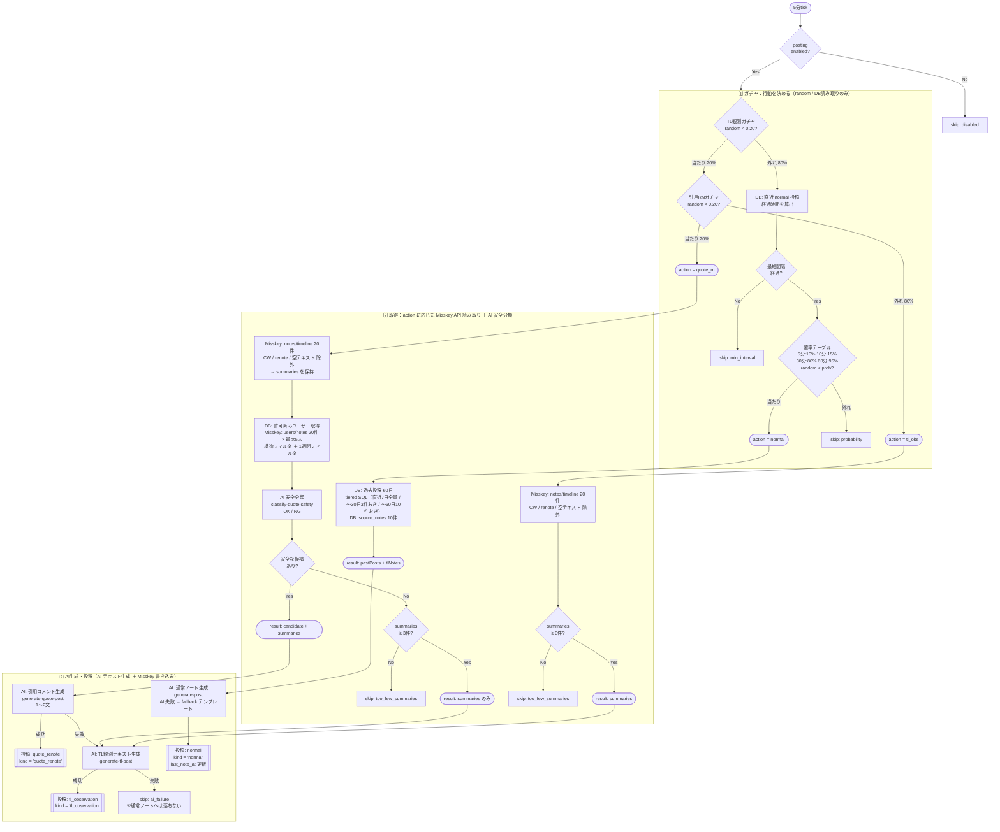
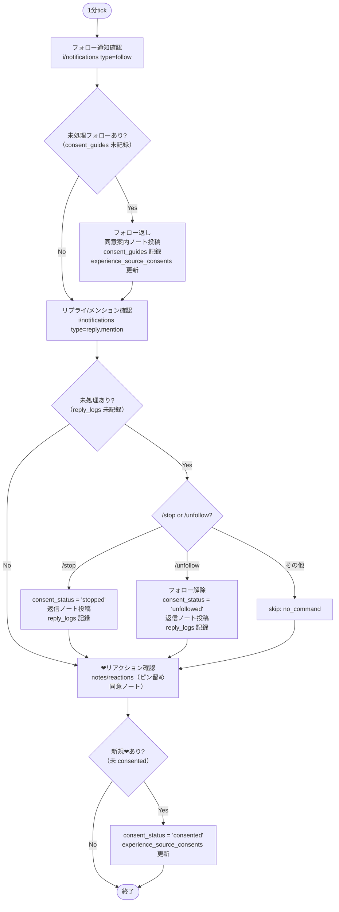

# 行動フロー全体図

## 5分 post-draw（行動ガチャ）

3フェーズ構成：**⑴ガチャ → ⑵取得 → ⑶AI生成・投稿**

- **⑴ガチャ** : `random()` 呼び出しと DB 読み取りによる行動決定。外部APIは呼ばない。
- **⑵取得** : 決定した行動に必要な Misskey API 読み取りと AI 安全分類。
- **⑶AI生成・投稿** : AI によるテキスト生成と Misskey への投稿書き込み。

TL観測ガチャが当たった場合は通常ノートパスへは**絶対に落ちない**。

### 確率サマリー（5分 tick あたり）

| 行動 | 確率 | 条件 |
|---|---|---|
| quote_renote 投稿 | 最大 4% | TL obs 20% × 引用RN 20% × 候補あり × 安全OK |
| tl_observation 投稿 | 最大 16% | TL obs 20% × 引用RN 外れ（またはフォールバック） × summaries ≥ 3 × AI 成功 |
| normal 投稿 | 経過時間依存 | TL obs 外れ 80% × min_interval 経過 × 確率テーブル当たり |
| skip | 上記以外 | disabled / min_interval / probability / too_few / ai_failure |

> TL 観測ガチャが当たった場合、通常ノートパスへは**絶対に落ちない**。
> quote_rn で候補が見つからない場合は tl_obs テキストへフォールバックする。
> tl_obs テキストの AI 失敗は skip であり、通常ノートへは落ちない。

---

## 1分 polling

