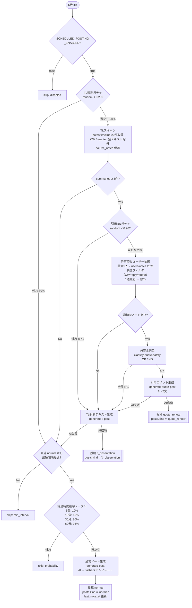
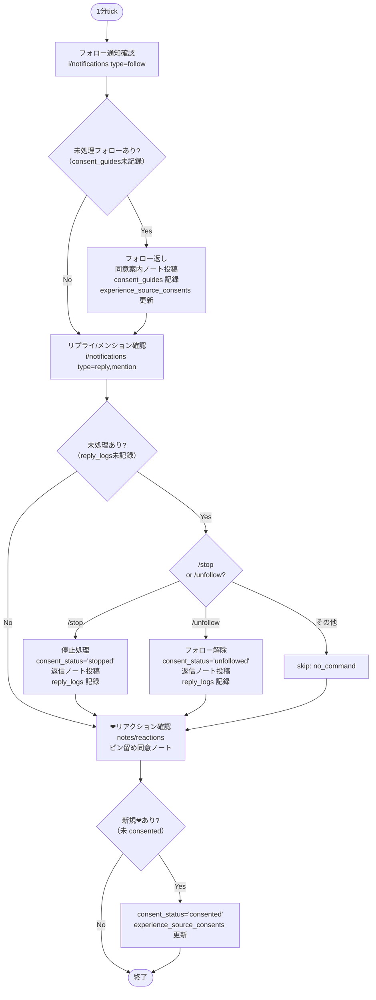
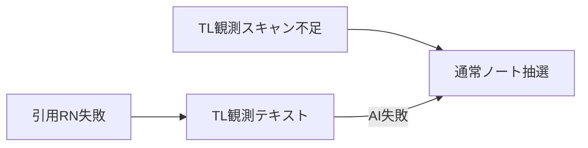

# 行動フロー全体図

## 5分 post-draw（行動ガチャ）

### 確率サマリー（5分tickあたり）

| 行動 | 確率 |
|---|---|
| skip: disabled / min_interval / probability | 状況による |
| 通常ノート投稿 | TL観測外れ（80%）× 経過時間確率 |
| TL観測テキスト投稿 | 16%（= 20% × 80%）|
| 引用RN投稿 | 最大4%（= 20% × 20%）、候補・安全判定次第で減少 |

---

## 1分 polling

---

## fall-through の連鎖

引用RNが失敗した場合はTL観測テキストへ、TL観測テキストも失敗・スキャン不足なら通常ノート抽選へと連鎖する。
