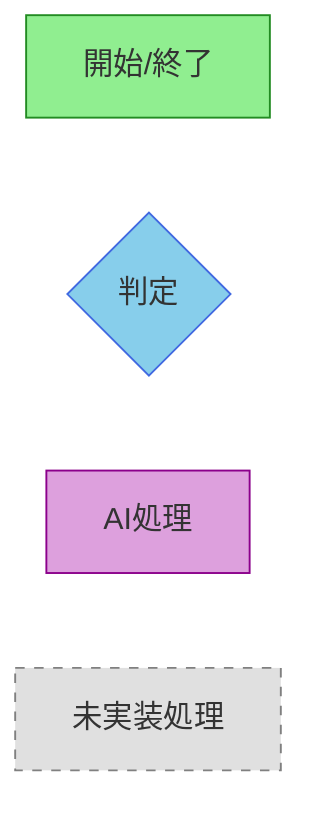
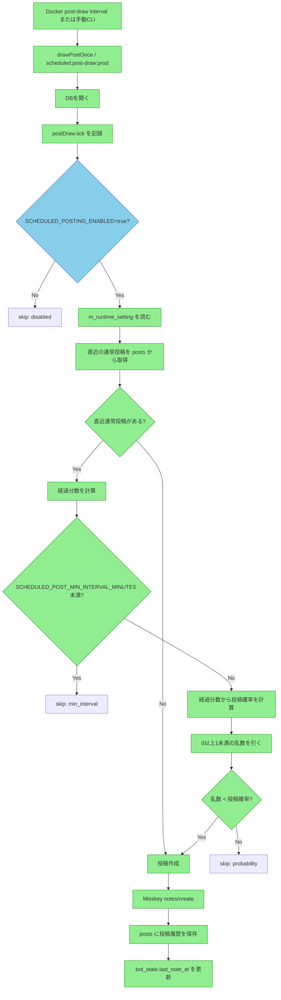
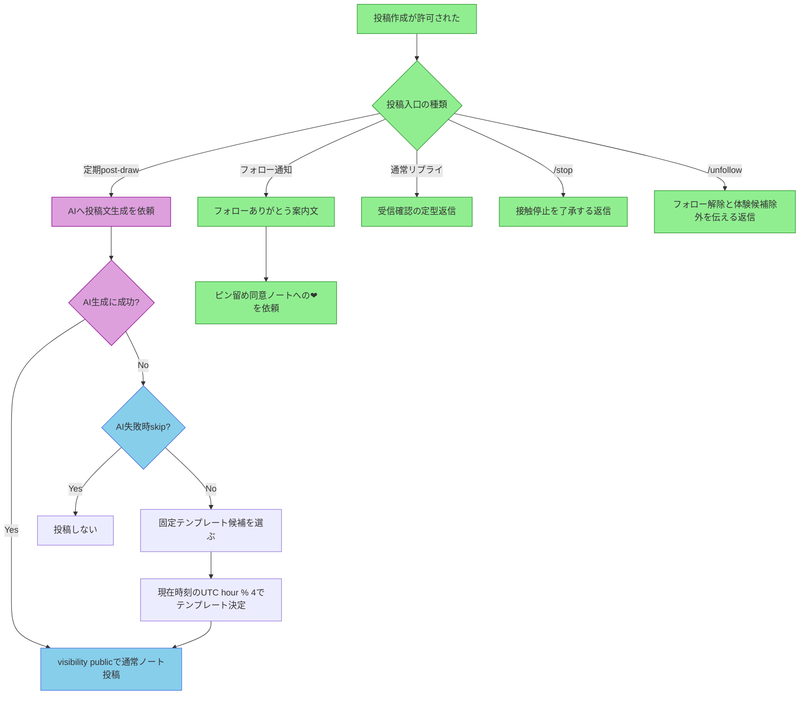
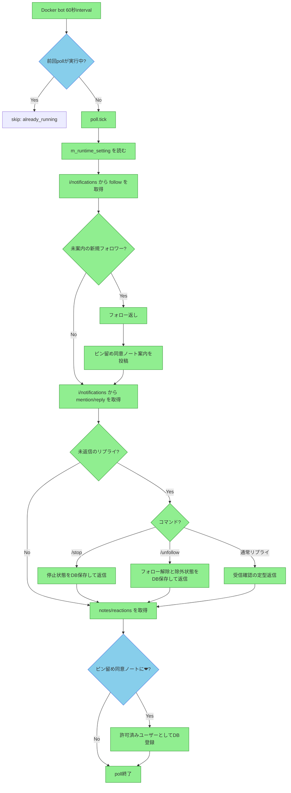
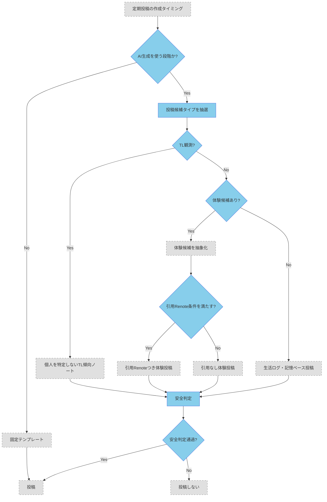
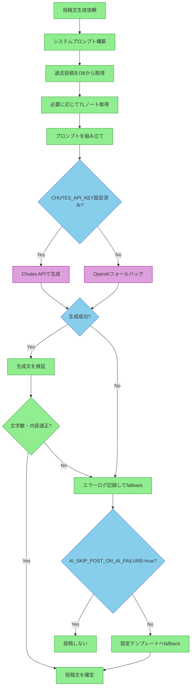
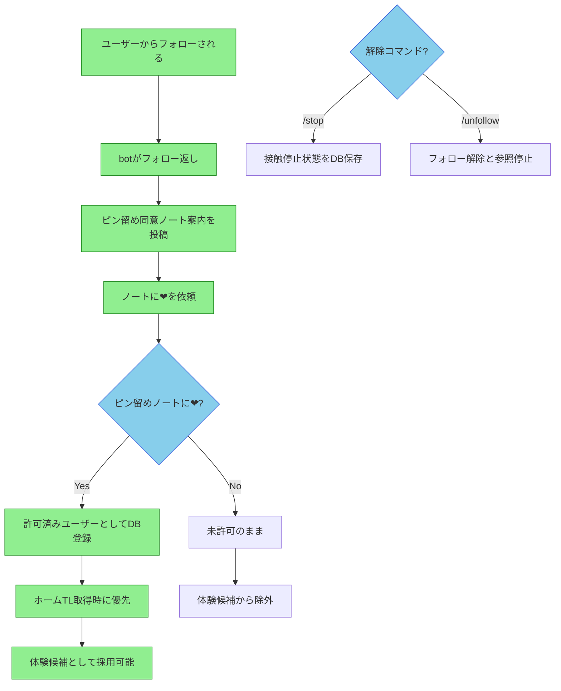

# Botフローチャート集

このドキュメントは、io-botの主要な業務フローをMermaid記法で視覚化したものです。
実装済みのフローは緑色、未実装（P1以降）のフローはグレー点線で表示しています。

## 凡例

| スタイル | 色 | 意味 |
|---|---|---|
| `implemented` | 緑 | 実装済みの処理 |
| `decision` | 青 | 判定・分岐 |
| `ai` | 紫 | AI関連の処理 |
| `pending` | グレー点線 | P1以降の未実装処理 |

## 目次

1. [定期投稿判定フロー](#定期投稿判定フロー)
2. [投稿内容選択フロー](#投稿内容選択フロー)
3. [常駐pollフロー](#常駐pollフロー)
4. [P1以降の投稿候補フロー](#p1以降の投稿候補フロー)
5. [AI生成プロセス詳細](#ai生成プロセス詳細)
6. [同意フロー（体験化許可）](#同意フロー体験化許可)

---

## 定期投稿判定フロー

Docker常駐プロセスが5分ごとに実行する投稿抽選の判定ロジック。

### 投稿確率の計算

| 経過時間 | 確率 | 判定 |
|---|---|---|
| 5分未満 | 0% | 必ずskip |
| 5分 | 10% | 抽選 |
| 10分 | 15% | 抽選 |
| 30分 | 80% | 抽選 |
| 60分以上 | 95% | 抽選 |

※5分以上は線形補間で確率を計算（例：20分経過時は10分地点15%と30分地点80%の間を補間）

---

## 投稿内容選択フロー

投稿作成が許可された後、どの内容を投稿するかを選択するフロー。

### 固定テンプレート一覧

| UTC hour % 4 | 種別 | 本文 |
|---|---|---|
| 0 | 生活ログ確認系 | 生活ログを確認してる。今日は少しだけ外の気配が近い気がする。 |
| 1 | 生活ログ同期系 | 生活ログを同期したよ。まだ遠くまでは行けないけど、次に行きたい場所は増えてる。 |
| 2 | 記憶をつなぐ系 | 今の私は、見たことと覚えたことを少しずつつないでるところ。今日のログもちゃんと残しておくね。 |
| 3 | 体験候補探索系 | 生活ログ、異常なし。次の体験候補を探しながら、もう少しだけ起きてる。 |

---

## 常駐pollフロー

Docker常駐プロセスが1分ごとに実行する通知処理とリアクション確認。

---

## P1以降の投稿候補フロー

P1以降に実装予定の高度な投稿フロー。現在は未実装（グレー点線）。

### P1以降の調整値

| 調整値 | DBキー | 初期値 | 備考 |
|---|---|---:|---|
| TL観測投稿の確率 | `TL_OBSERVATION_POST_PROBABILITY` | `0.20` | 現時点では未適用 |
| TL観測に使うノート数 | `TL_OBSERVATION_NOTE_COUNT` | `20` | 現時点では未適用 |
| 引用Renote採用確率 | `QUOTE_RENOTE_PROBABILITY` | `0.20` | 現時点では未適用 |
| 画像の標準cooldown | `EMOTION_ASSET_DEFAULT_COOLDOWN_HOURS` | `24` | 現時点では未適用 |

---

## AI生成プロセス詳細

投稿文のAI生成の内部フロー。Chutes API優先、失敗時にOpenAIフォールバック。

### AI生成の設定項目

| 設定項目 | 環境変数/DBキー | 初期値 | 説明 |
|---|---|---|---|
| Chutes APIキー | `CHUTES_API_KEY` | - | Chutes API認証 |
| OpenAI APIキー | `OPENAI_API_KEY` | - | フォールバック用 |
| Chutesモデル | `CHUTES_MODEL` | `mistralai/Devstral-2-123B-Instruct-2512-TEE` | 使用モデル |
| OpenAIモデル | `OPENAI_MODEL` | `gpt-4o-mini` | フォールバックモデル |
| AI失敗時skip | `AI_SKIP_POST_ON_AI_FAILURE` | `true` | trueでfallbackしない |
| 生成最大トークン | `AI_POST_GENERATION_MAX_TOKENS` | `600` | P1以降有効 |
| Temperature | `AI_TEMPERATURE_TEXT` | `0.8` | P1以降有効 |

---

## 同意フロー（体験化許可）

フォロワーからの同意を得て、体験化候補に登録するフロー。

### 同意の状態遷移

| 状態 | 遷移条件 | 結果 |
|---|---|---|
| 未許可 | フォローされる | 案内投稿送信 |
| 許可待ち | ピン留めノートに❤ | 許可済みに登録 |
| 許可済み | - | 体験候補として利用可能 |
| 停止 | /stopコマンド | 接触停止（リプライ・引用RNなし） |
| 解除 | /unfollowコマンド | フォロー解除・参照停止 |

---

## 更新履歴

| 日付 | 内容 |
|---|---|
| 2026-05-02 | 初版作成。6つのフローを統合。実装済み/P1以降を色分け。 |
