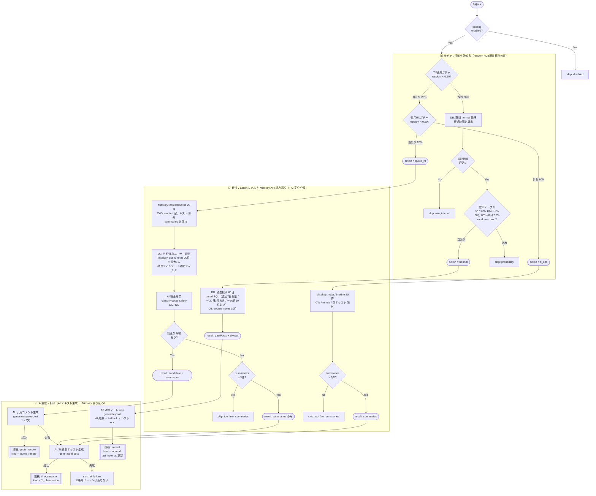
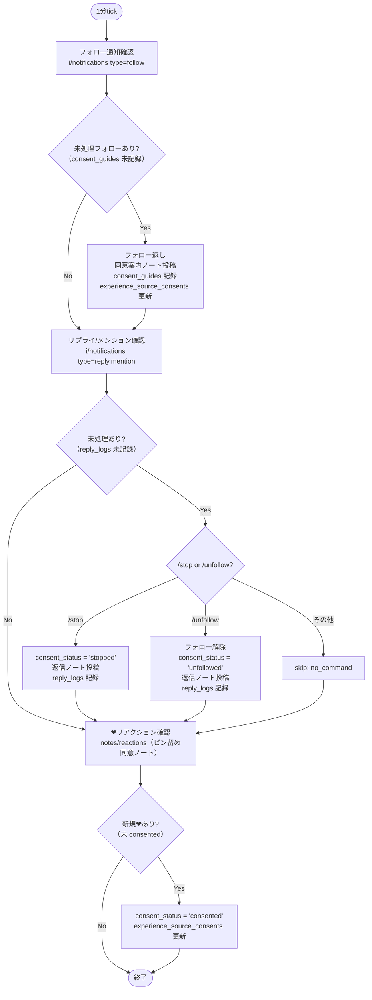
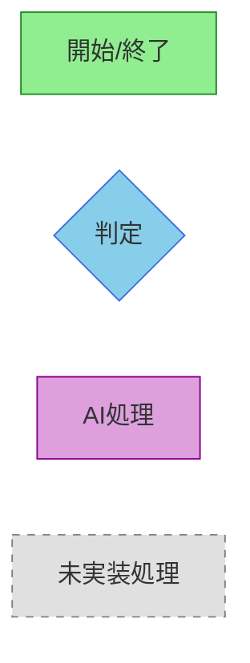
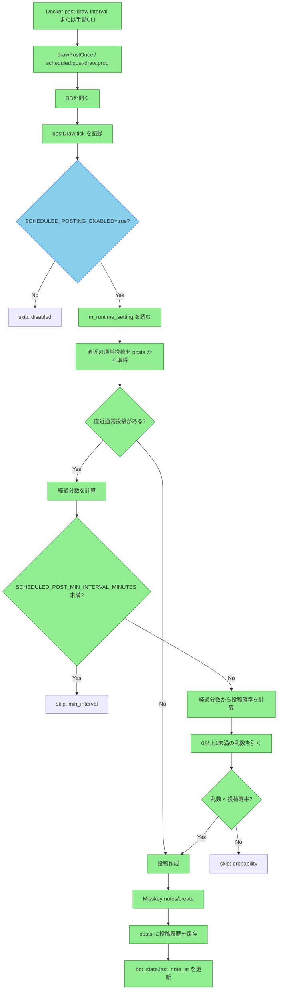
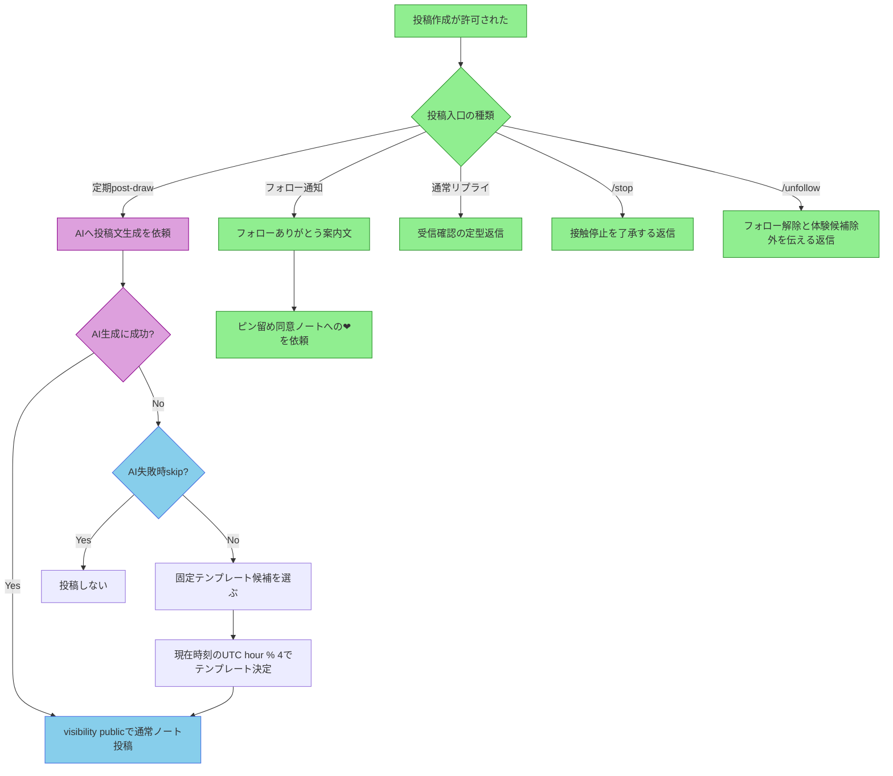
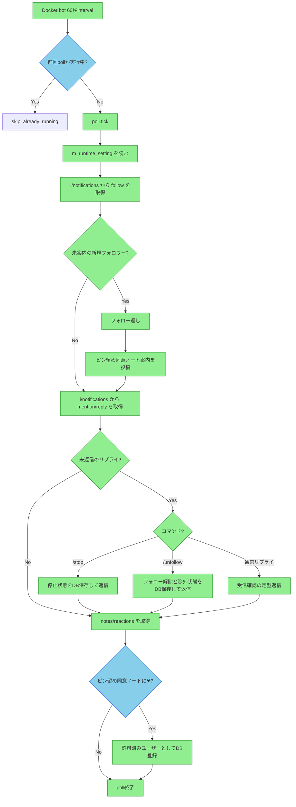
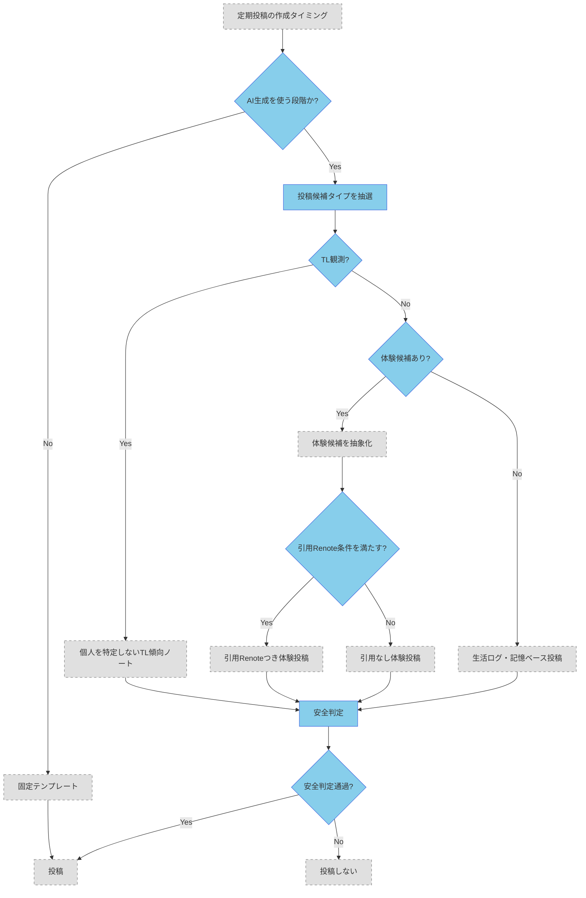
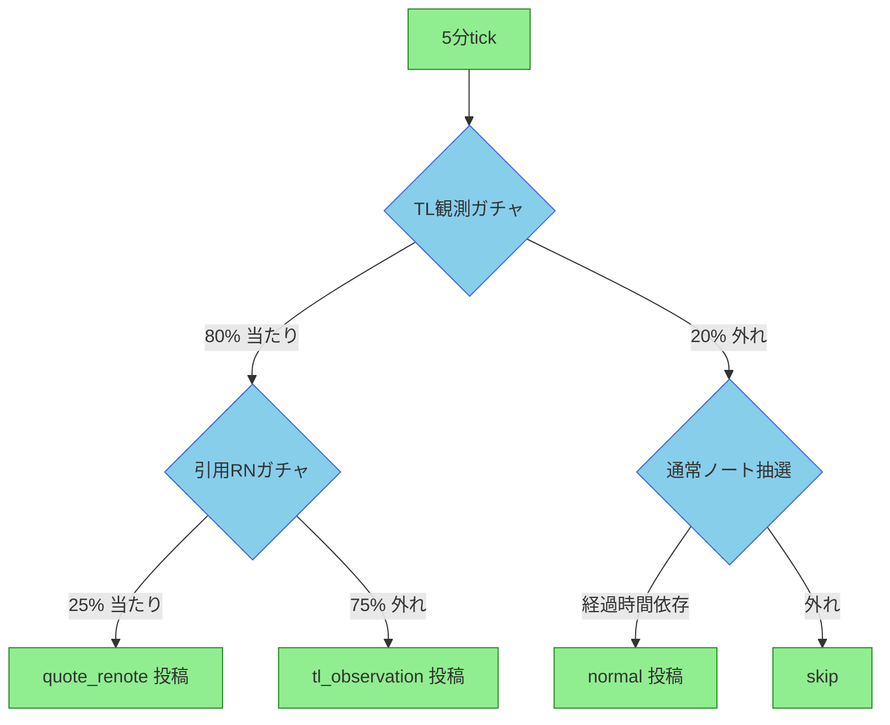
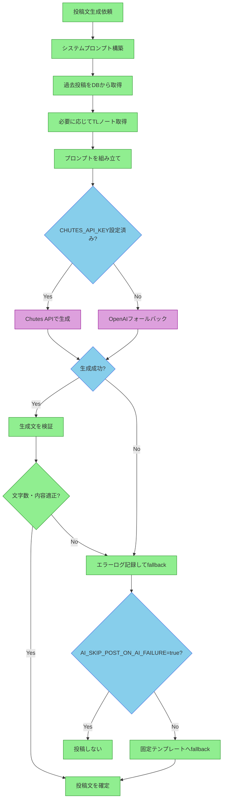
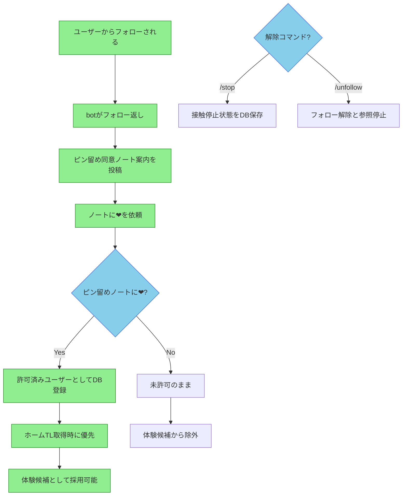

# Legacy Flow Records

このファイルは、分散していた確定仕様をテーマ別に統合したもの。

---

## 旧ファイル: legacy-flows.md

# 行動フロー全体図

## 5分 post-draw（行動ガチャ）

3フェーズ構成：**⑴ガチャ → ⑵取得 → ⑶AI生成・投稿**

- **⑴ガチャ** : `random()` 呼び出しと DB 読み取りによる行動決定。外部APIは呼ばない。
- **⑵取得** : 決定した行動に必要な Misskey API 読み取りと AI 安全分類。
- **⑶AI生成・投稿** : AI によるテキスト生成と Misskey への投稿書き込み。

TL観測ガチャが当たった場合は通常ノートパスへは**絶対に落ちない**。

### 確率サマリー（5分 tick あたり）

| 行動 | 確率 | 条件 |
|---|---|---|
| quote_renote 投稿 | 最大 4% | TL obs 20% × 引用RN 20% × 候補あり × 安全OK |
| tl_observation 投稿 | 最大 16% | TL obs 20% × 引用RN 外れ（またはフォールバック） × summaries ≥ 3 × AI 成功 |
| normal 投稿 | 経過時間依存 | TL obs 外れ 80% × min_interval 経過 × 確率テーブル当たり |
| skip | 上記以外 | disabled / min_interval / probability / too_few / ai_failure |

> TL 観測ガチャが当たった場合、通常ノートパスへは**絶対に落ちない**。
> quote_rn で候補が見つからない場合は tl_obs テキストへフォールバックする。
> tl_obs テキストの AI 失敗は skip であり、通常ノートへは落ちない。

---

## 1分 polling

---

## 旧ファイル: legacy-flows.md

# Botフローチャート集

このドキュメントは、io-botの主要な業務フローをMermaid記法で視覚化したものです。
実装済みのフローは緑色、未実装（P1以降）のフローはグレー点線で表示しています。

## 凡例

| スタイル | 色 | 意味 |
|---|---|---|
| `implemented` | 緑 | 実装済みの処理 |
| `decision` | 青 | 判定・分岐 |
| `ai` | 紫 | AI関連の処理 |
| `pending` | グレー点線 | P1以降の未実装処理 |

## 目次

1. [定期投稿判定フロー](#定期投稿判定フロー)
2. [投稿内容選択フロー](#投稿内容選択フロー)
3. [常駐pollフロー](#常駐pollフロー)
4. [P1以降の投稿候補フロー](#p1以降の投稿候補フロー)
5. [AI生成プロセス詳細](#ai生成プロセス詳細)
6. [同意フロー（体験化許可）](#同意フロー体験化許可)

---

## 定期投稿判定フロー

Docker常駐プロセスが5分ごとに実行する投稿抽選の判定ロジック。

### 投稿確率の計算

| 経過時間 | 確率 | 判定 |
|---|---|---|
| 5分未満 | 0% | 必ずskip |
| 5分 | 10% | 抽選 |
| 10分 | 15% | 抽選 |
| 30分 | 80% | 抽選 |
| 60分以上 | 95% | 抽選 |

※5分以上は線形補間で確率を計算（例：20分経過時は10分地点15%と30分地点80%の間を補間）

---

## 投稿内容選択フロー

投稿作成が許可された後、どの内容を投稿するかを選択するフロー。

### 固定テンプレート一覧

| UTC hour % 4 | 種別 | 本文 |
|---|---|---|
| 0 | 生活ログ確認系 | 生活ログを確認してる。今日は少しだけ外の気配が近い気がする。 |
| 1 | 生活ログ同期系 | 生活ログを同期したよ。まだ遠くまでは行けないけど、次に行きたい場所は増えてる。 |
| 2 | 記憶をつなぐ系 | 今の私は、見たことと覚えたことを少しずつつないでるところ。今日のログもちゃんと残しておくね。 |
| 3 | 体験候補探索系 | 生活ログ、異常なし。次の体験候補を探しながら、もう少しだけ起きてる。 |

---

## 常駐pollフロー

Docker常駐プロセスが1分ごとに実行する通知処理とリアクション確認。

---

## P1以降の投稿候補フロー

P1以降に実装予定の高度な投稿フロー。現在は未実装（グレー点線）。

### Beta-Test1 モードの確率テーブル

beta-test1 有効時の、5分 tick あたりの投稿内容別確率。

| 内容 | 確率 | 計算式 |
|---|---:|---|
| 引用Renote | **20%** | TL観測 80% × 引用RN 25% |
| TL観測ノート | **60%** | TL観測 80% × 引用RN外れ 75% |
| 通常ノート | **~20%** | TL観測外れ 20% × 経過時間判定 |

### P1以降の調整値

| 調整値 | DBキー | 初期値 | 備考 |
|---|---|---:|---|
| TL観測投稿の確率 | `TL_OBSERVATION_POST_PROBABILITY` | `0.20` | 現時点では未適用 |
| TL観測に使うノート数 | `TL_OBSERVATION_NOTE_COUNT` | `20` | 現時点では未適用 |
| 引用Renote採用確率 | `QUOTE_RENOTE_PROBABILITY` | `0.20` | 現時点では未適用 |
| 画像の標準cooldown | `EMOTION_ASSET_DEFAULT_COOLDOWN_HOURS` | `24` | 現時点では未適用 |

---

## AI生成プロセス詳細

投稿文のAI生成の内部フロー。Chutes API優先、失敗時にOpenAIフォールバック。

### AI生成の設定項目

| 設定項目 | 環境変数/DBキー | 初期値 | 説明 |
|---|---|---|---|
| Chutes APIキー | `CHUTES_API_KEY` | - | Chutes API認証 |
| OpenAI APIキー | `OPENAI_API_KEY` | - | フォールバック用 |
| Chutesモデル | `CHUTES_MODEL` | `mistralai/Devstral-2-123B-Instruct-2512-TEE` | 使用モデル |
| OpenAIモデル | `OPENAI_MODEL` | `gpt-4o-mini` | フォールバックモデル |
| AI失敗時skip | `AI_SKIP_POST_ON_AI_FAILURE` | `true` | trueでfallbackしない |
| 生成最大トークン | `AI_POST_GENERATION_MAX_TOKENS` | `600` | P1以降有効 |
| Temperature | `AI_TEMPERATURE_TEXT` | `0.8` | P1以降有効 |

---

## 同意フロー（体験化許可）

フォロワーからの同意を得て、体験化候補に登録するフロー。

### 同意の状態遷移

| 状態 | 遷移条件 | 結果 |
|---|---|---|
| 未許可 | フォローされる | 案内投稿送信 |
| 許可待ち | ピン留めノートに❤ | 許可済みに登録 |
| 許可済み | - | 体験候補として利用可能 |
| 停止 | /stopコマンド | 接触停止（リプライ・引用RNなし） |
| 解除 | /unfollowコマンド | フォロー解除・参照停止 |

---

## 更新履歴

| 日付 | 内容 |
|---|---|
| 2026-05-02 | 初版作成。6つのフローを統合。実装済み/P1以降を色分け。 |

