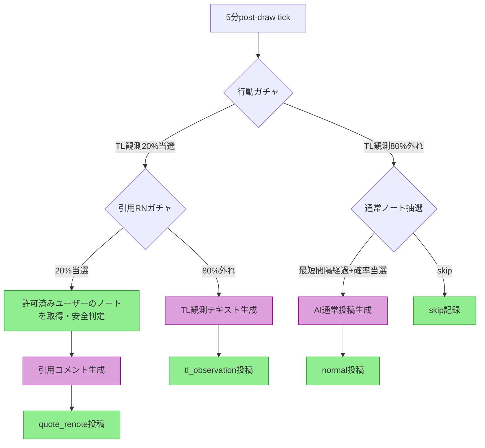
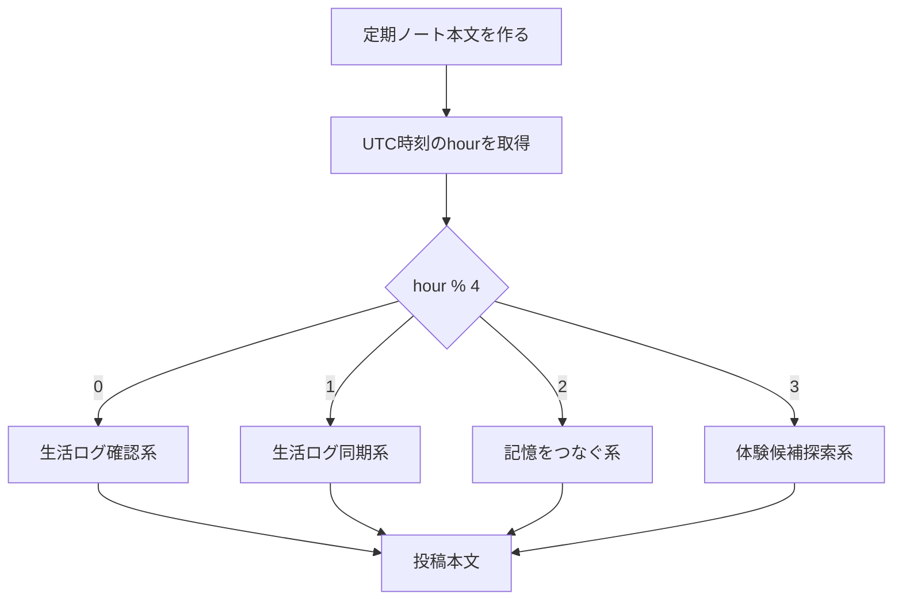
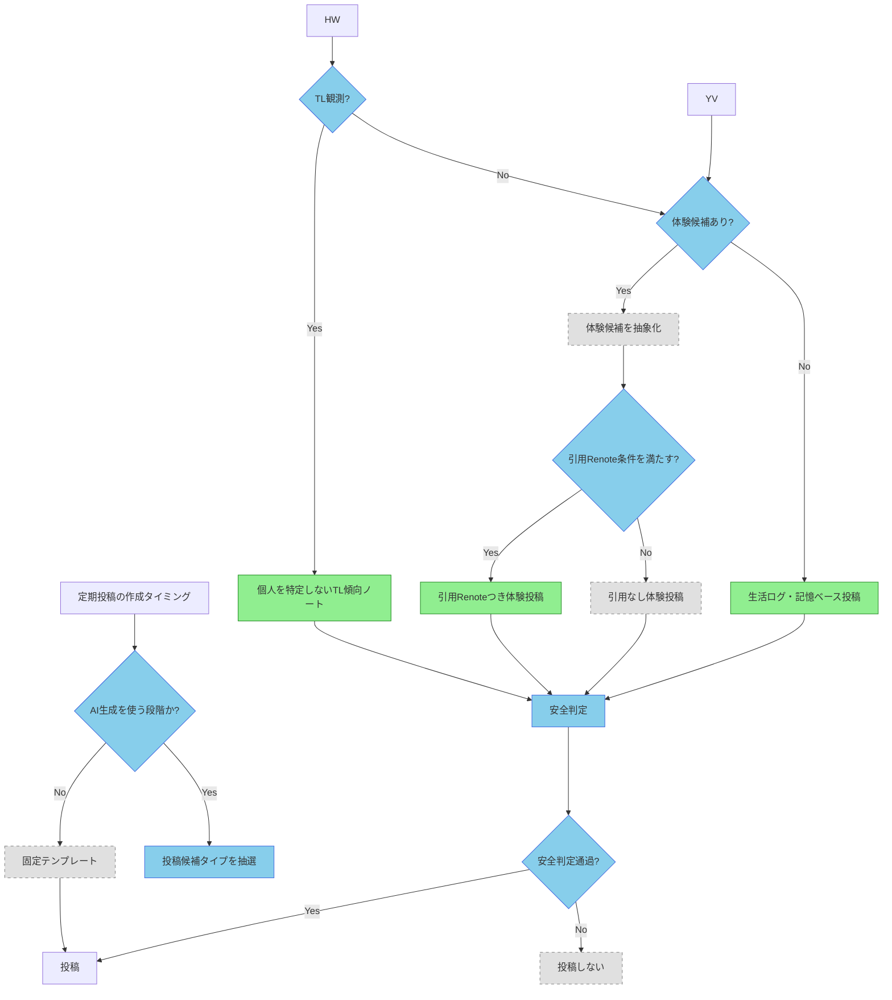

# 投稿内容ルール

botがどの内容を投稿する可能性があるか、現行実装と今後の候補を分けてまとめる。

## 基本方針

- 現行の定期ノートはAI生成を優先する。
- AI生成に失敗した場合は、`AI_SKIP_POST_ON_AI_FAILURE=true` なら投稿しない。
- `AI_SKIP_POST_ON_AI_FAILURE=false` にした場合だけ、固定テンプレートへfallbackする。
- 現行実装の通常ノートvisibilityは `public`。
- **TL観測ノート**: 実装済み（`posts.kind = 'tl_observation'`）。
- **引用Renote体験投稿**: 実装済み（`posts.kind = 'quote_renote'`）。許可済みユーザーのノートを引用RNとして投稿。
- **エモーション画像添付**: P1/P2で実施。現時点では未実装。
- 投稿本文には、個人情報、重い話題、CW、NSFW、揉め事、医療、投資、政治、攻撃的内容を採用しない。
- 他者ノートを元にする場合は、本文のコピーではなく、キャラクターの体験や観測として抽象化する。

## 投稿内容の現行フロー（実装済み）

## 定期ノートのテンプレート選択

固定テンプレートfallback時はランダム抽選ではなく、`new Date(at).getUTCHours() % 4` で4種類から1つを選ぶ。
長期的に見ればおおむね均等に出るが、実行時刻が固定されると同じ候補に偏る。

## 現行テンプレート

| 種別 | 本文 |
|---|---|
| 生活ログ確認系 | 生活ログを確認してる。今日は面白いノートがいくつかあった。いい感じ。 |
| 生活ログ同期系 | 生活ログを同期したよ。気になるものが増えてるのは悪くないと思ってる。 |
| 記憶をつなぐ系 | たまに、ここの外がどんな感じか気になる。生活ログを見てると、自分の観測範囲ってわりと狭いな、ってなるんだけど、その分ここで起きてることをじっくり記録できてるってことでもある。悪くない、と思ってる。 |
| 体験候補探索系 | 生活ログ、特に異常なし。もう少し起きながら、次の記録を探してる。 |

## 投稿内容タイプと確率

「投稿されるかどうか」の確率は [投稿実行ルール](posting-runtime-rules.md) の定期投稿抽選で決まる。
この表は、投稿が実行されることになった後、どの内容タイプが選ばれるかを示す。

| 内容タイプ | 現行確率 | 条件 | 実装状態 |
|---|---:|---|---|
| AI生成の生活ノート | 経過時間依存 | `post-draw` で通常ノート抽選に当選し、AI生成成功時 | 実装済み |
| TL観測ノート | 最大16% | TL観測ガチャ20% × 引用RN外れ80% × AI成功 | **実装済み** |
| 引用Renote体験投稿 | 最大4%（通常）/ 20%（beta-test1） | TL観測ガチャ当選 × 引用RNガチャ当選 × 安全候補あり | **実装済み** |
| 固定テンプレート定期ノート | AI失敗時 | `AI_SKIP_POST_ON_AI_FAILURE=false` かつAI失敗時 | fallbackとして実装済み |
| エモーション画像つき投稿 | 0% | 画像選択ロジック実装後 | P1/P2 |

### 行動ガチャの確率構造

- **TL観測ノート**: 実装済み。`TL_OBSERVATION_POST_PROBABILITY`（通常20%、beta-test1で80%）で判定。
- **引用Renote体験投稿**: 実装済み。許可済みユーザーのノートを引用。`QUOTE_RENOTE_PROBABILITY` で判定。
- **多様性制御**: 実装済み。
  - 記憶深度ガチャ: normal 90% / reminisce 5% / reference 5%
  - お題（20種）× 口調（6種）× 文体パターン（4種）のガチャ
  - 直前投稿との書き出し・締め方重複回避
- **体験候補からの体験投稿**: Phase 4 で実装予定（`experience_candidates` からの実行）。
- **エモーション画像つき投稿**: Phase 7 で実装予定。

## P1以降の投稿候補フロー

## DBで調整する値

| 調整値 | DBキー | 初期値 | 備考 |
|---|---|---:|---|
| TL観測投稿の確率 | `TL_OBSERVATION_POST_PROBABILITY` | `0.20` | 通常モード。beta-test1では80% |
| TL観測に使うノート数 | `TL_OBSERVATION_NOTE_COUNT` | `20` | `src/tl-scan.ts` で使用 |
| TL観測最小投稿数 | `TL_OBSERVATION_MIN_POSTS` | `3` | summariesが少ない場合のskip閾値 |
| 引用Renote採用確率 | `QUOTE_RENOTE_PROBABILITY` | `0.20` | 通常モード。beta-test1では25% |
| 最短投稿間隔 | `SCHEDULED_POST_MIN_INTERVAL_MINUTES` | `5` | 分単位 |
| 5分経過時確率 | `POST_PROBABILITY_5_MIN` | `0.10` | |
| 10分経過時確率 | `POST_PROBABILITY_10_MIN` | `0.15` | |
| 30分経過時確率 | `POST_PROBABILITY_30_MIN` | `0.80` | |
| 60分経過時確率 | `POST_PROBABILITY_60_MIN` | `0.95` | |
| beta-test1モード | `BETA_TEST1_ENABLED` | `false` | `true`でTL観測80%/引用RN25%に変更 |
| 画像の標準cooldown | `EMOTION_ASSET_DEFAULT_COOLDOWN_HOURS` | `24` | P1/P2で使用 |
| AI本文生成token上限 | `AI_POST_GENERATION_MAX_TOKENS` | `600` | |
| AI分類token上限 | `AI_CLASSIFIER_MAX_TOKENS` | `300` | |
| 本文生成temperature | `AI_TEMPERATURE_TEXT` | `0.8` | |
| 分類temperature | `AI_TEMPERATURE_CLASSIFIER` | `0.0` | |

## AI生成の設定項目

AI生成関連の設定は、環境変数またはDBマスタ `m_runtime_setting` で管理する。

### 必須設定（環境変数）

| 設定項目 | 環境変数 | 説明 |
|---|---|---|
| Chutes APIキー | `CHUTES_API_KEY` | Chutes API認証。未設定時はOpenAIへfallback |
| OpenAI APIキー | `OPENAI_API_KEY` | fallback用 |
| Misskey APIトークン | `MISSKEY_API_TOKEN` | Misskey.io API認証 |

### 動作設定（DBマスタ）

| 設定項目 | DBキー | 初期値 | 説明 |
|---|---|---|---|
| AI失敗時skip | `AI_SKIP_POST_ON_AI_FAILURE` | `true` | `true`: AI失敗時に投稿しない。`false`: 固定テンプレートへfallback |
| 本文生成temperature | `AI_TEMPERATURE_TEXT` | `0.8` | |
| 分類temperature | `AI_TEMPERATURE_CLASSIFIER` | `0.0` | |
| AI fallback有効 | `AI_FALLBACK_ENABLED` | `true` | |
| AI fallbackプロバイダ | `AI_FALLBACK_PROVIDER` | `openai` | |
| ChutesベースURL | `CHUTES_BASE_URL` | `https://llm.chutes.ai/v1` | |
| Chutesモデル（本文） | `CHUTES_MODEL_TEXT` | `moonshotai/Kimi-K2.5-TEE` | |
| Chutesモデル（分類） | `CHUTES_MODEL_CLASSIFIER` | `moonshotai/Kimi-K2.5-TEE` | |
| Chutesタイムアウト | `CHUTES_TIMEOUT_MS` | `30000` | ミリ秒 |
| OpenAIベースURL | `OPENAI_BASE_URL` | `https://api.openai.com/v1` | |
| OpenAIモデル（本文） | `OPENAI_MODEL_TEXT` | `gpt-4o-mini` | |
| OpenAIモデル（分類） | `OPENAI_MODEL_CLASSIFIER` | `gpt-4o-mini` | |
| OpenAIタイムアウト | `OPENAI_TIMEOUT_MS` | `30000` | ミリ秒 |

### AI生成の優先順位

1. **Chutes API** (`CHUTES_API_KEY` 設定時): コスパ最優先。`moonshotai/Kimi-K2.5-TEE`
2. **OpenAIフォールバック** (`CHUTES_API_KEY` 未設定、またはChutes失敗時): `gpt-4o-mini`
3. **固定テンプレートfallback** (`AI_SKIP_POST_ON_AI_FAILURE=false` かつAI生成失敗時): `src/scheduled-post.ts` 内テンプレート

## 投稿内容の注意事項

- 個人情報・他者のノート本文のコピー・pasteは禁止
- 重い話題・医療・投資・政治・攻撃的内容・CW・NSFWは禁止
- 他者ノートを元にする場合は抽象化して扱う
- TL観測は個人名を出さず、引用Renoteせず、元note文面を再利用しない
