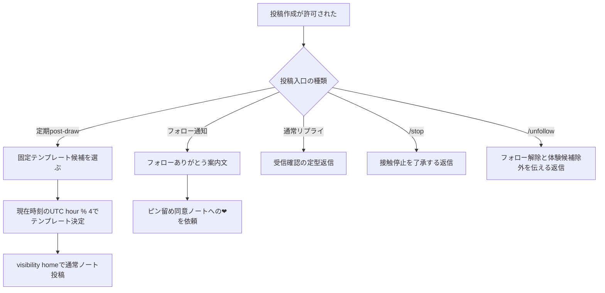
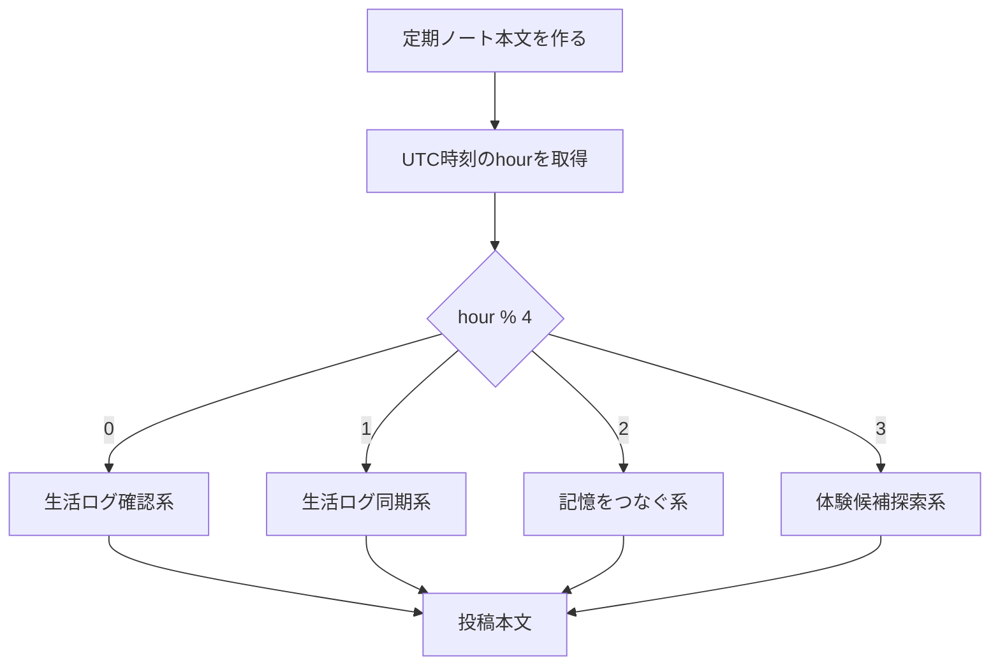
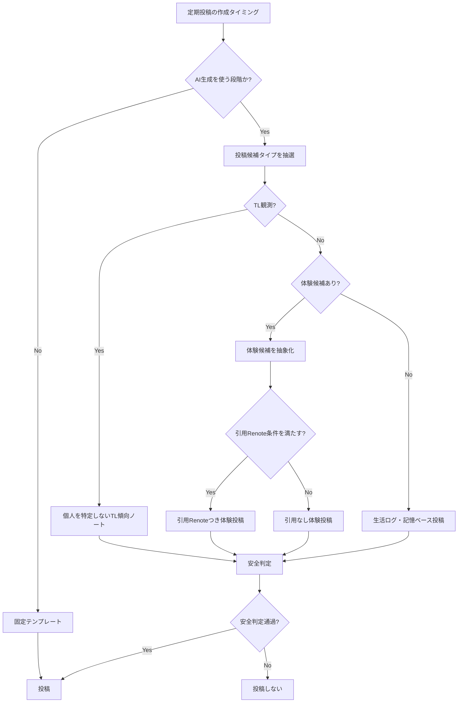

# 投稿内容ルール

botがどの内容を投稿する可能性があるか、現行実装と今後の候補を分けてまとめる。

## 基本方針

- 現行の定期ノートはAI生成を使わない固定テンプレート。
- 初回実投稿は `home` visibilityで開始する。
- 他者ノートを参考にした体験投稿、TL観測、引用Renote、エモーション画像添付、AI生成本文はP1以降。
- 投稿本文には、個人情報、重い話題、CW、NSFW、揉め事、医療、投資、政治、攻撃的内容を採用しない。
- 他者ノートを元にする場合は、本文のコピーではなく、キャラクターの体験や観測として抽象化する。

## 投稿内容の現行フロー

## 定期ノートのテンプレート選択

現行実装ではランダム抽選ではなく、`new Date(at).getUTCHours() % 4` で4種類から1つを選ぶ。
長期的に見ればおおむね均等に出るが、実行時刻が固定されると同じ候補に偏る。

## 現行テンプレート

| 種別 | 本文 |
|---|---|
| 生活ログ確認系 | 生活ログを確認してる。今日は少しだけ外の気配が近い気がする。 |
| 生活ログ同期系 | 生活ログを同期したよ。まだ遠くまでは行けないけど、次に行きたい場所は増えてる。 |
| 記憶をつなぐ系 | 今の私は、見たことと覚えたことを少しずつつないでるところ。今日のログもちゃんと残しておくね。 |
| 体験候補探索系 | 生活ログ、異常なし。次の体験候補を探しながら、もう少しだけ起きてる。 |

## 投稿内容タイプと確率

「投稿されるかどうか」の確率は [投稿実行ルール](posting-runtime-rules.md) の定期投稿抽選で決まる。
この表は、投稿が実行されることになった後、どの内容タイプが選ばれるかを示す。

| 内容タイプ | 現行確率 | 条件 | 実装状態 |
|---|---:|---|---|
| 固定テンプレート定期ノート | 100% | `post-draw` が投稿判定を通過した場合 | 実装済み |
| AI生成の生活ノート | 0% | AI client、安全判定、prompt整備後 | P1以降 |
| TL観測ノート | 0% | `TL_OBSERVATION_POST_PROBABILITY` を使う段階 | P1以降 |
| 体験候補からの体験投稿 | 0% | 体験候補収集と採用判定の実装後 | P1以降 |
| 引用Renoteつき体験投稿 | 0% | 許可済みユーザー、引用条件、安全判定通過後 | P1以降 |
| エモーション画像つき投稿 | 0% | 画像選択ロジックと添付処理の実装後 | P1/P2 |

現行の固定テンプレート4種類の選択比率は、UTC時刻が均等に分散する前提では各25%相当。
ただし、30分scheduleは実行時刻が偏るため、実測比率は25%からずれる可能性がある。

| 固定テンプレート種別 | 選択条件 | 目安比率 |
|---|---|---:|
| 生活ログ確認系 | `UTC hour % 4 = 0` | 25% |
| 生活ログ同期系 | `UTC hour % 4 = 1` | 25% |
| 記憶をつなぐ系 | `UTC hour % 4 = 2` | 25% |
| 体験候補探索系 | `UTC hour % 4 = 3` | 25% |

## P1以降の投稿候補フロー

## P1以降にDBで調整する候補値

| 調整値 | DBキー | 初期値 | 備考 |
|---|---:|---:|---|
| TL観測投稿の確率 | `TL_OBSERVATION_POST_PROBABILITY` | `0.20` | 現時点では未適用 |
| TL観測に使うノート数 | `TL_OBSERVATION_NOTE_COUNT` | `20` | 現時点では未適用 |
| 引用Renote採用確率 | `QUOTE_RENOTE_PROBABILITY` | `0.20` | 現時点では未適用 |
| 画像の標準cooldown | `EMOTION_ASSET_DEFAULT_COOLDOWN_HOURS` | `24` | 現時点では未適用 |
| AI本文生成token上限 | `AI_POST_GENERATION_MAX_TOKENS` | `600` | AI client実装後に使用 |
| AI分類token上限 | `AI_CLASSIFIER_MAX_TOKENS` | `300` | AI client実装後に使用 |
| 本文生成temperature | `AI_TEMPERATURE_TEXT` | `0.8` | AI client実装後に使用 |
| 分類temperature | `AI_TEMPERATURE_CLASSIFIER` | `0.0` | AI client実装後に使用 |

## 投稿内容の注意事項

- 許可済みユーザーのノートを参考にしても、本文をそのまま写さない。
- 「誰かがやっていたから自分もした」という投稿は、対象ユーザーが許可済みで、安全判定を通った場合に限る。
- 許可不要のTL観測は、個人名や具体的な投稿内容ではなく「TLにこういう空気があった」程度に抽象化する。
- 引用Renoteはフォロワー獲得の導線になり得るが、相手への通知と拡散が発生するため、頻度制限と安全判定を必ず通す。
- CW、NSFW、病気、事故、揉め事、政治、医療、投資、成人向け、攻撃的内容は採用しない。
- prompt全文、AI reasoning本文、API key、未公開情報はログや投稿に出さない。
