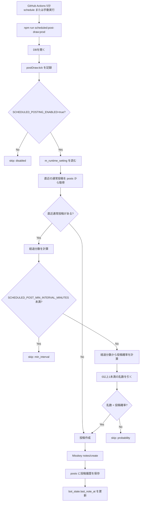
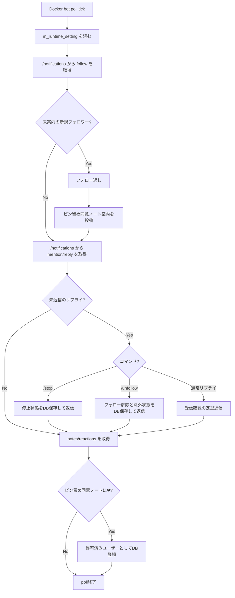

# 投稿実行ルール

botが投稿するかどうかを判断するための、時間、制約、安全スイッチ、調整箇所をまとめる。

## 基本方針

- GitHub Actionsの定期投稿は、`SCHEDULED_POSTING_ENABLED=true` のときだけ実投稿する。
- GitHub Actionsの `Scheduled Post Draw` は5分ごとに起動し、毎回投稿抽選を行う。
- GitHub Actionsのscheduleは最短5分間隔で、混雑時は遅延することがある。
- `SCHEDULED_POSTING_ENABLED=false` または未設定の場合、workflowやCLIは成功しても投稿しない。
- 投稿間隔、投稿確率、polling上限などの非secret運用値はDBマスタ `m_runtime_setting` で管理する。
- API key、Misskey token、DB接続文字列はDBマスタに置かず、環境変数またはGitHub secretsに置く。
- 通常投稿の連投防止は、DBの `posts` に記録された直近 `kind = normal` の投稿時刻で判定する。

## 定期投稿の判定フロー



## 定期投稿の調整値

現在の値は次のSQLで確認する。

```sql
SELECT category, setting_key, setting_value, value_type, description
FROM m_runtime_setting
ORDER BY category, setting_key;
```

| 調整したいこと | DBキー | 初期値 | 影響 |
|---|---:|---:|---|
| 通常投稿の最低間隔 | `SCHEDULED_POST_MIN_INTERVAL_MINUTES` | `5` | この分数未満なら必ず投稿しない |
| 5分経過時の投稿確率 | `POST_PROBABILITY_5_MIN` | `0.10` | 5分直後の投稿されやすさ |
| 10分経過時の投稿確率 | `POST_PROBABILITY_10_MIN` | `0.15` | 10分前後の投稿されやすさ |
| 30分経過時の投稿確率 | `POST_PROBABILITY_30_MIN` | `0.80` | 30分前後の投稿されやすさ |
| 60分以降の投稿確率 | `POST_PROBABILITY_60_MIN` | `0.95` | 長く空いた時の投稿されやすさ |
| 1回のpollで処理するフォロー数 | `FOLLOW_PROBE_MAX_PER_POLL` | `1` | フォロー返しと案内投稿の最大数 |
| 1回のpollで返信するリプライ数 | `REPLY_PROBE_MAX_PER_POLL` | `1` | 連続返信の最大数 |
| 通知取得数 | `NOTIFICATION_FETCH_LIMIT` | `20` | 1回のpollで見る通知の件数 |
| リアクション取得数 | `REACTION_FETCH_LIMIT` | `100` | 同意ノートの❤確認件数 |

## 投稿確率の考え方

5分未満は確率ではなく強制skip。
5分以上は、DBにある確率点を線形補間して投稿抽選を行う。

| 直近通常投稿からの経過 | 現行確率 | 判定 |
|---:|---:|---|
| 5分未満 | 0% | 必ずskip |
| 5分 | 10% | 抽選 |
| 10分 | 15% | 抽選 |
| 30分 | 80% | 抽選 |
| 60分以上 | 95% | 抽選 |

例: 20分経過時は、10分地点15%と30分地点80%の間を線形補間する。

## 常駐pollの投稿系フロー

Docker常駐プロセスは、1分ごとに通知とリアクションを確認する。



## 事故防止の安全弁

- 定期投稿の最終安全スイッチは `SCHEDULED_POSTING_ENABLED`。
- 問題があればGitHub repository variablesの `SCHEDULED_POSTING_ENABLED=false` に戻す。
- Docker常駐側で問題があれば `docker compose down` で止める。
- 連続投稿の制御は、今後 `NOTES_PER_HOUR`、`NOTES_PER_DAY`、`QUOTE_RENOTES_PER_DAY` を使ったrate limitへ拡張する。
- 現時点で `NOTES_PER_HOUR` などはDBマスタに存在するが、汎用rate limitとしての本格適用はP1以降。

## 実投稿前の確認

- Misskey tokenに投稿、通知取得、リアクション確認、フォロー操作に必要な権限がある。
- `DATABASE_PROVIDER=postgres` と `DATABASE_URL` がローカルDocker、GitHub Actionsで同じNeon DBを指している。
- `m_runtime_setting` がmigration済み。
- 初回は `SCHEDULED_POSTING_ENABLED=false` でActions手動実行し、`scheduledPost.skip reason=disabled` を確認する。
- `true` にする前に、misskey.io上の直近通常投稿から5分以上空いていることを確認する。
